# Object_Tracker_using_Detectron2
This repository contains the source code necessary to track objects in video.

## Results
We present some of the results using our tracker:

  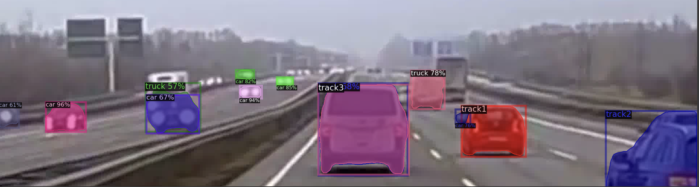
  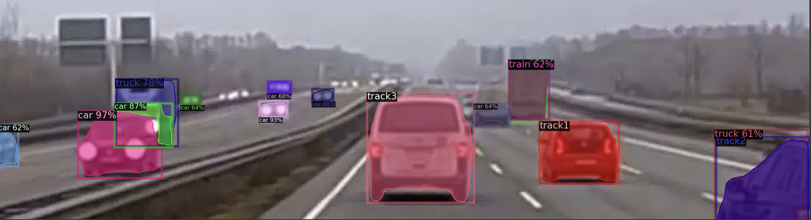
  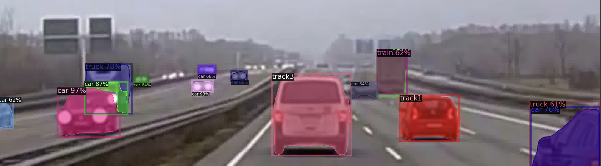
  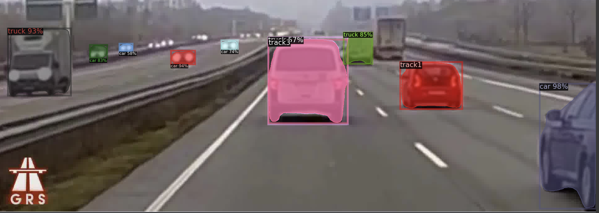
  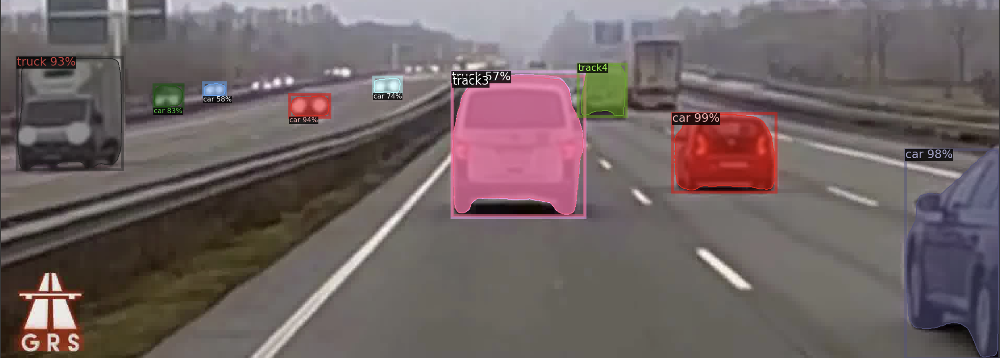
  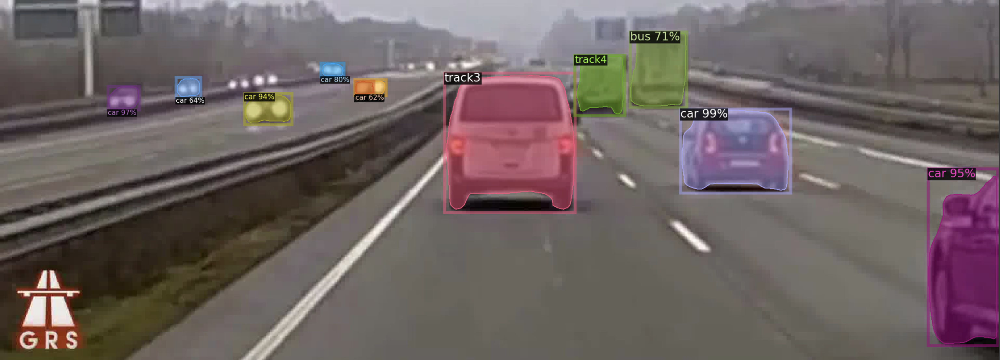
  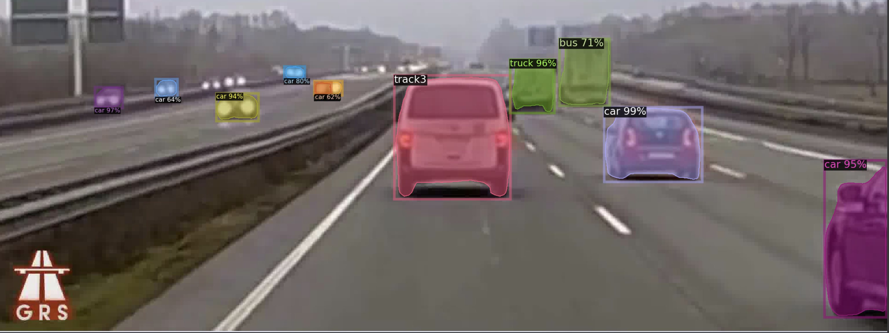
  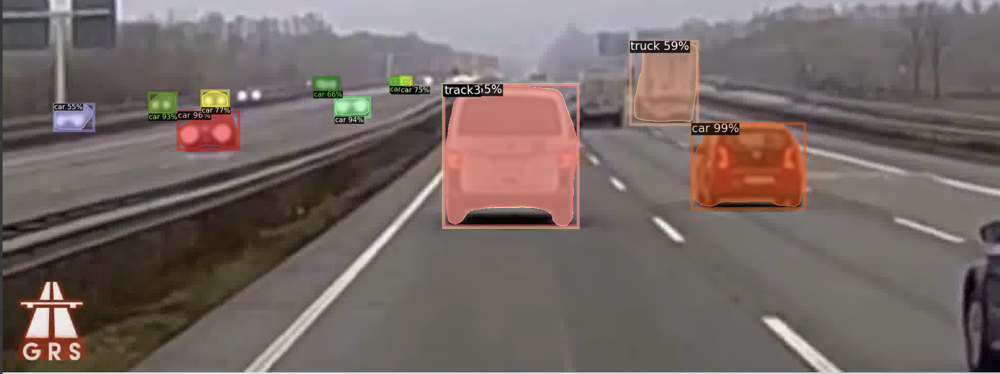
  
  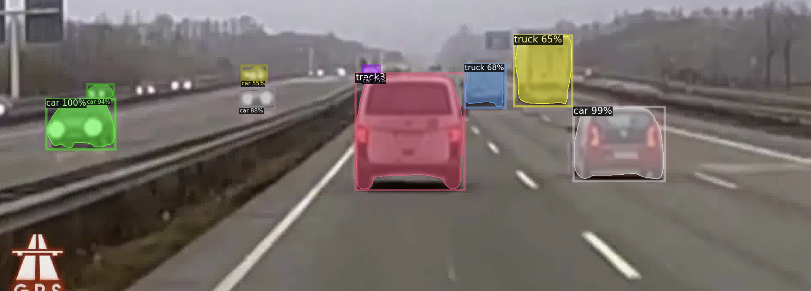
  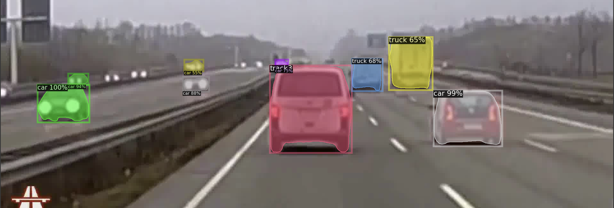
  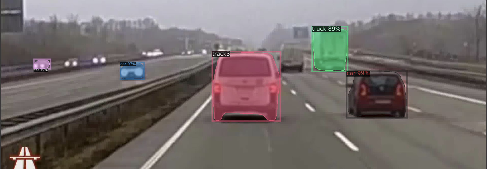
  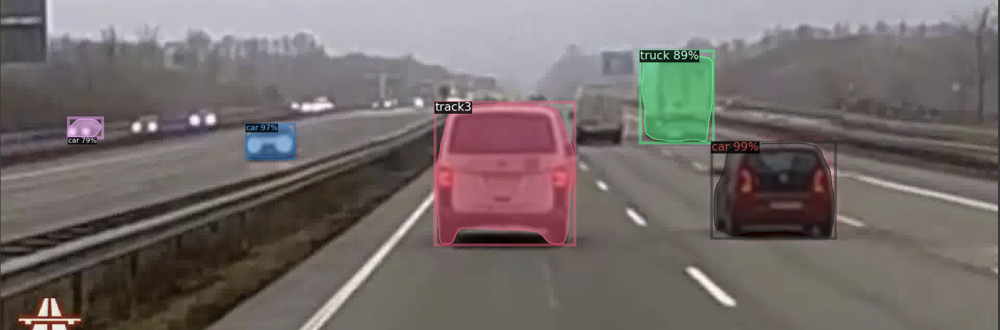
  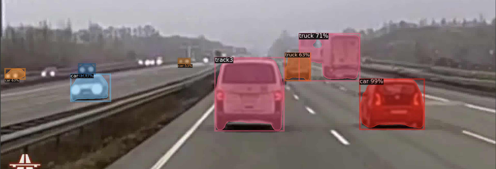
  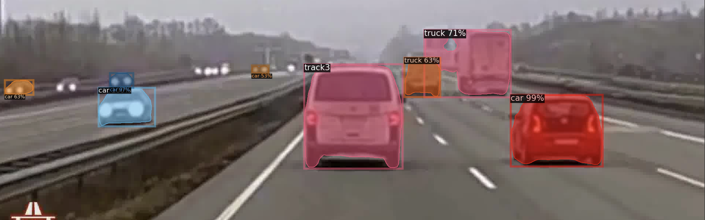
  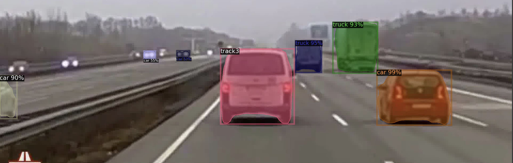
  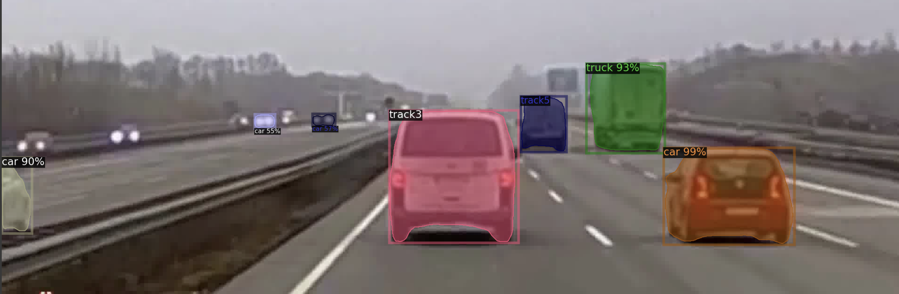
  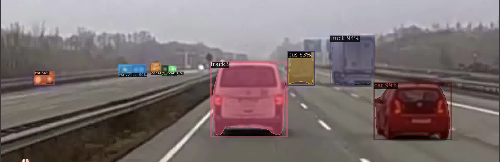

## Repository contents
* The whole idea is implemented in [Object_Tracker](Object_Tracker.ipynb) notebook. It is done in PyTorch.
* [Images folder](images) contains images we got using our tracker. 
